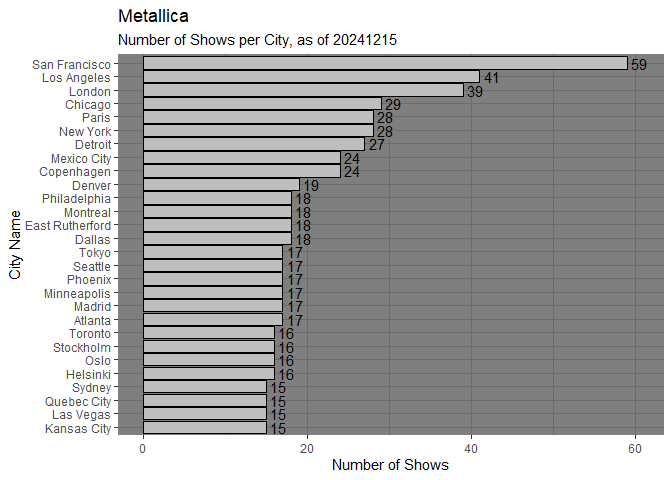
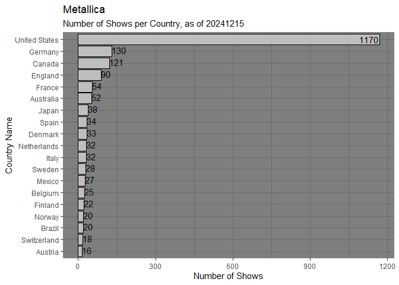
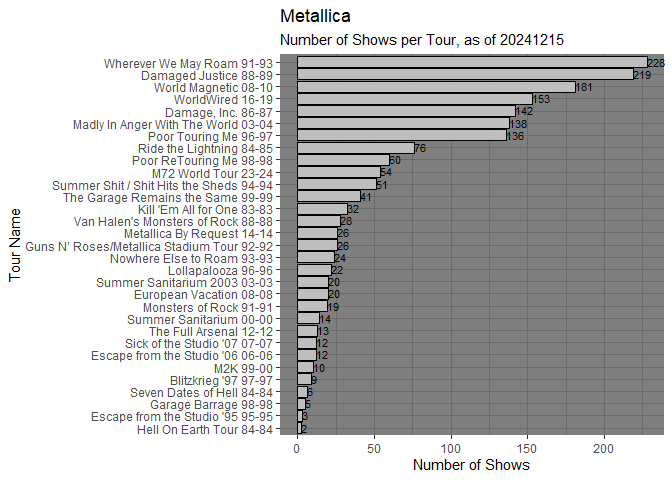
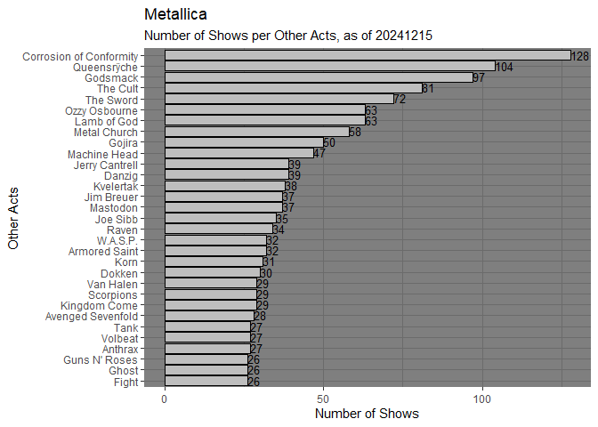
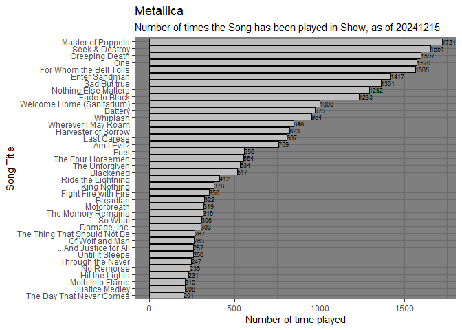

# Metallica Shit Project: Shows Stats

2024-12-15

## List of Figures

<a href="#fig-met_shows_stats1" class="quarto-xref">Figure 1</a> Number
of Shows per Year.  
<a href="#fig-met_shows_stats2" class="quarto-xref">Figure 2</a> Number
of Shows per City.  
<a href="#fig-met_shows_stats3" class="quarto-xref">Figure 3</a> Number
of Shows per Country.  
<a href="#fig-met_shows_stats4" class="quarto-xref">Figure 4</a> Number
of Shows per Tour.  
<a href="#fig-met_shows_stats5" class="quarto-xref">Figure 5</a> Number
of Times for Other Acts.  
<a href="#fig-met_shows_stats6" class="quarto-xref">Figure 6</a> Number
of Times the Song has been played.

Figure 1: Number of Shows per Year.

Figure 2: Number of Shows per City

Figure 3: Number of Shows per Country

Figure 4: Number of Shows per Tour

Figure 5: Number of Shows per Other Acts.

Figure 6: Number of times the Song has been played.

